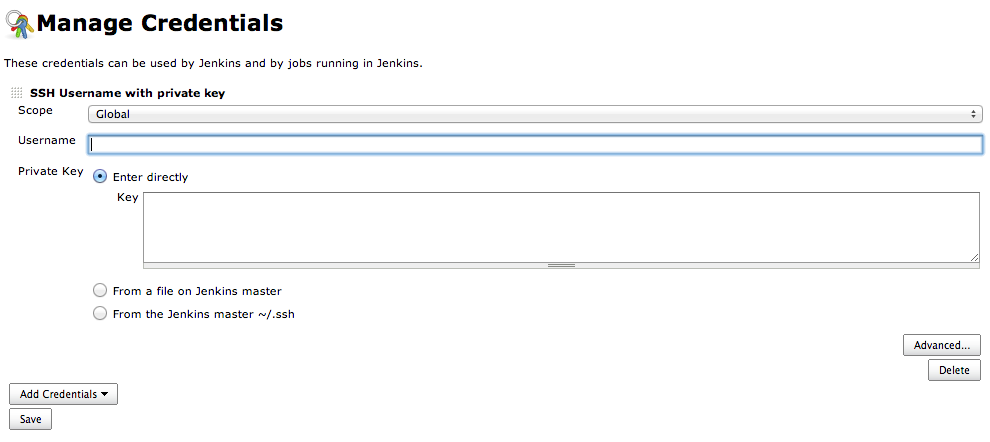
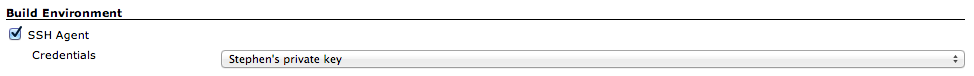
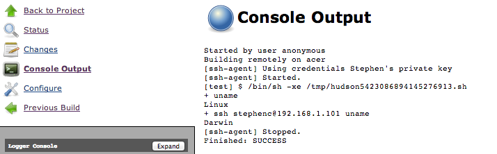

# SSH Agent Plugin

This plugin allows you to provide SSH credentials to builds via a
ssh-agent in Jenkins.

# Requirements

Currently all **Windows** nodes (including the master) on which this
plugin will be used must have the [Apache Tomcat Native
libraries](http://tomcat.apache.org/native-doc/){.external-link}
installed. As of 1.0 should be unnecessary for Unix nodes. As of 1.14
unnecessary if `ssh-agent` is installed.

# Configuring

First you need to add some SSH Credentials to your instance:

Jenkins \| Manage Jenkins \| Manage Credentials

{.confluence-embedded-image
.confluence-content-image-border}

Note that only Private Key based credentials can be used.

Then configure your build to use the credentials:

{.confluence-embedded-image
.confluence-content-image-border}

And then your build will have those credentials available, e.g.

{.confluence-embedded-image
.confluence-content-image-border}

From a Pipeline job, use the `sshagent` step.

# Installation Example: MacOSX (10.7.5)

**Irrelevant in 1.14+ when `ssh-agent` is available in the path.**

Prerequisites:

-   JDK7. The tomcat native libraries target the java 7 version.
-   APR - this seems to be preinstalled in /usr/lib/apr.

Note that tomcat itself is not needed. This works fine with winstone
(just running jenkins jar from command line).

Download and extract the tomcat native
library: <http://tomcat.apache.org/download-native.cgi>

    tar -zxvf tomcat-native-1.1.XX-src.tar.gz

Build the native library:

    cd tomcat-native-1.1.XX/jni/native

    ./configure --with-apr=/usr/bin/apr-1-config

    make && sudo make install

Build the java interface:

    cd ..
    export JAVA_HOME=/Library/Java/JavaVirtualMachines/jdk1.7.0_17.jdk/Contents/Home

    ant build

    ant jar

Copy the output jar somewhere suitable for inclusion in your jenkins
CLASSPATH.

Set environment variables prior to starting jenkins:

    export DYLD_LIBRARY_PATH=/usr/local/apr/lib
    export CLASSPATH=/path/to/tomcat-native-1.1.XX.jar
    java -jar jenkins.war

Additionally, you might have to add bouncycastle to your JCE providers.
If you attempt to use the plugin and get an exception like the
following:

    java.lang.IllegalStateException: BouncyCastle must be registered as a JCE provider

Then you may need to configure the jce provider. One way is to do this
right in the JRE, so if Jenkins is using the same jdk as above, edit

/Library/Java/JavaVirtualMachines/jdk1.7.0\_17.jdk/Contents/Home/jre/lib/security/java.security,
and add the following line:

    security.provider.11=org.bouncycastle.jce.provider.BouncyCastleProvider

Then, restart jenkins.

From there, configure using the instructions above.

# Version History

For new versions, see [GitHub releases](https://github.com/jenkinsci/ssh-agent-plugin/releases).

For old versions, see the [old changelog](docs/old-changelog.md).
